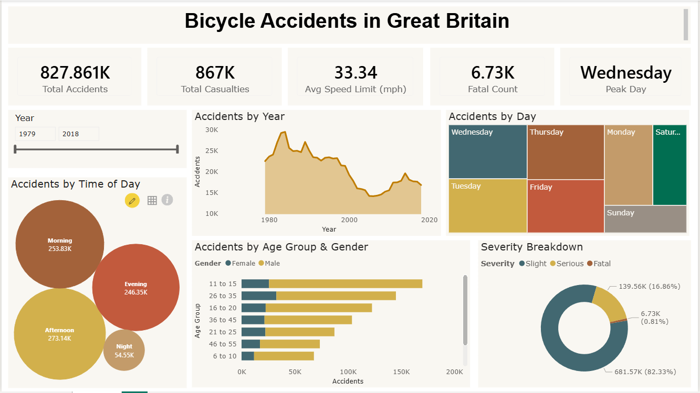

# Bicycle Accidents Dashboard

## Overview
Power BI dashboard analyzing 827,000+ bicycle accident records in Great Britain (1979–2018).

## Dashboard

## Key Findings
- Accidents declined from ~30K/year in the 1980s to ~15K–18K by the 2010s
- Afternoons and weekdays (especially Wednesday) see the highest accident volumes
- 11–15 age group has the most accidents; males overrepresented across all age groups
- 82.33% slight, 16.86% serious, 0.81% fatal

## Tools Used
- Power BI (DAX measures, slicers, KPI cards)

## Dataset
[Bicycle Accidents in Great Britain – Kaggle](https://www.kaggle.com/datasets/johnharshith/bicycle-accidents-in-great-britain-1979-to-2018)

## Report
See `Dashboard_Report.pdf` for the full analytical report.
